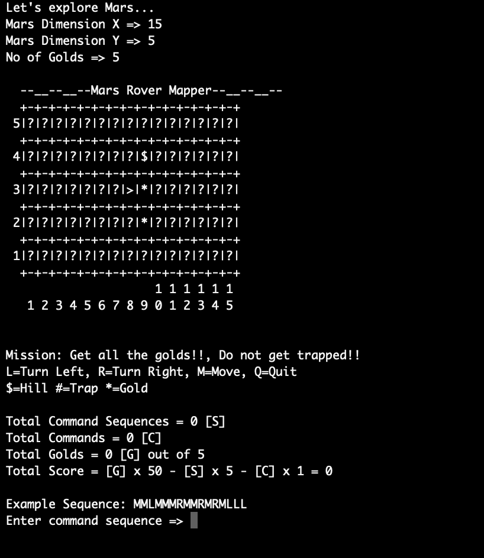
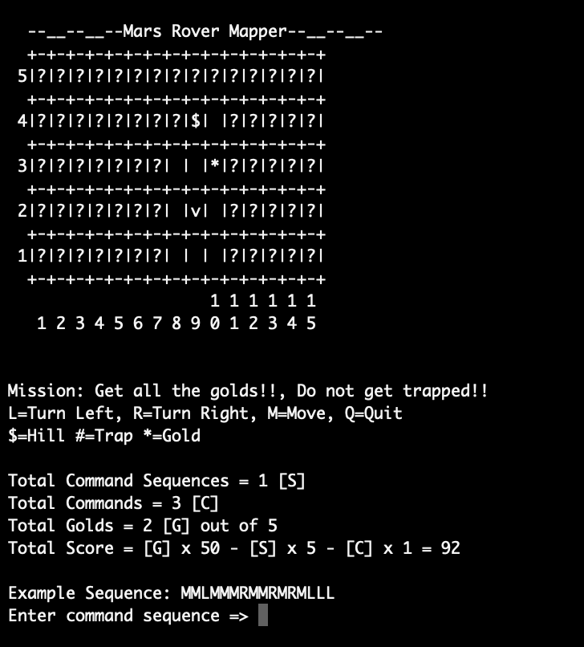
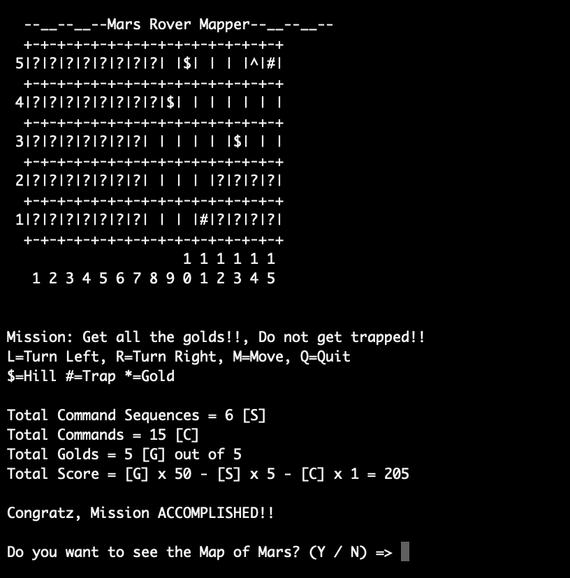

# Explore Mars CLI game in C++.

## Introduction
**Explore Mars**  is a single player game with the purpose of this game being to find all the gold pieces on Mars. The map of Mars is a custom grid that can be set by the player as per their choice. Once you collect all the gold pieces, you win the game. The lesser amount of commands you take to collect all the gold pieces, the higher your score will be.

This was my first project using C++ and I started making this game to help out a friend with his assignment.
This was the first time I built an algorithm to populate the Mars map grid with gold in a way that there is always a possible route through which winning the game is possible.

## Features

* Complete command line interface.
* All the controls are from the keyboard.
* Custom map size.

# Install

* Run the main.cpp file in a C++ compiler of your choice to start the game.

# Play Instructions

* As the Rover moves across the map, it would be able to read the three cells just in front of it.

* There are hills on the map which prevent the Rover from moving to those cells.

* There are traps on the map, if the Rover moves to any of those cells, the mission is failed.

* The lesser amount of commands you use to find all the gold pieces, the higher your score will be.

# Images

----
Made with ❤️ by [Mohammad Shahdad](https://github.com/MohammadShahdad)
